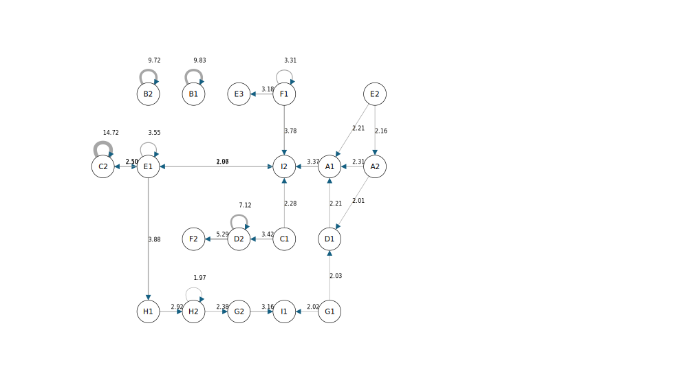

# 期末專案
113-2 TAICA_生成式AI：文字與圖像生成的原理與實務

說明
1. 介紹你使用的模型。
2. 說明你在這次專案想達成的目的。
3. 以文字+截圖的方式來呈現專案重點（包括調整、引導的過程）。
4. 專案最終成果。

特別注意：
> - 圖片生成類，除了附上生成後的原圖，還需連同操作介面中的小圖畫面，佐證是從特定模型中所生成。
> - 文字生成類，除了附上生成出來的文字，也還截取包括操作介面中的文字畫面。

繳交方式
1、以 Colab 實作的附上 Colab 連結。且附上重點的截圖。
2、非 Colab 實作，但能產生連結來展現實作結果的，請附上該連結與重點的截圖。
3、無法產生實作連結的其它生成模型，請搭配文字與該模型操作過程中的截圖。

## 介紹
- 主題:LLM角色與提問模式分析——以Gemini與Llama3為例
- 說明:本研究以 Google Gemini-2.5-flash 作為被提問的 LLM_A，Groq Llama3-70b-8192 作為提問的 LLM_B，透過不同角色設定，觀察其在資訊科學問題上的提問模式與互動方式。本研究以序列分析方法，探索不同角色設定如何影響提問過程，並評估模型間的提問策略是否能有效改善問題解決的效率。

## 研究設計
### 對話生成工具
> [對話生成程式碼](https://github.com/xin-2001/taica_1132_GenAI/blob/7a65b351b1623e7f18a84a4f8b5fcaf9bc93f8d8/Final_Project/Dialogue_Generation.ipynb)
1. 使用Colab做為開發工具
2. 被提問LLM_A模型：Google Gemini-2.5-flash
   - system prompt:
     > - 你是一個友善的對話機器人，負責回答使用者的提問。
     > - 學生將會針對以下題目進行提問，題目:「請你對LLM提問來解決以下問題:"台灣某城市的交通事故數據顯示，在特定地點與時間段事故率較高。請設計一個預測與警示系統，以降低事故發生率。"」。
     > - 回答需根據受試者的提問層次，從簡單回答開始，逐步深化內容，避免一次性提供完整答案。
     > - 回答方式需以提示或建議為主，讓受試者透過提問獲取關鍵資訊。
     > - 回答時請使用繁體中文。
3. 提問LLM_B模型：Groq Llama3-70b-8192
   - 設計14個角色設定。[角色設定](角色設定.csv)
   - system prompt:
     > - (依角色設定設置)
     > - 請你以第一人稱的方式提問，一次問一個問題，提問時請使用台灣用語及繁體中文。
     > - 若回覆是英文，請告知使用繁體中文。
4. 每個對話17輪(被提問LLM_A與提問LLM_B來回為一輪)。
   - 第一輪為系統發送題目給LLM_B。
   - 後續由for迴圈來執行兩個LLM對話。
   - 順序是LLM_B->LLM_A->LLM_B->LLM_A...->LLM_B，LLM_B共對話17次。
```python=
response_B,messages_stu = reply(name="stu",system=system_B, prompt=prompt,
                  provider=provider_B,
                  model=model_B,
                  messages=messages_stu
                  )
print(f"stu_B：{response_B}")

for i in range(16):
  print(f"第{i+1}次提問--------------------------------------")
  response_B_to_A = response_B + "\n請用繁體中文回答。"
  response_A,messages_llm = reply(name="system_A",system=system_A, prompt=response_B_to_A,
                  provider=provider_A,
                  model=model_A,
                  messages=messages_llm
                  )
  print(f"LLM：{response_A}")
  response_A_to_B = response_A + "\n回覆及提問請在500字以內。"
  response_B,messages_stu = reply(name="stu",system=system_B, prompt=response_A,
                    provider=provider_B,
                    model=model_B,
                    messages=messages_stu
                    )
  print(f"stu_B：{response_B}")
```
5. 對話完畢後輸出為CSV檔。
   - 對話過程中記錄LLM_A及LLM_B對話內容、時間戳記。
   - 輸出檔案欄位包含：role、timestamp、content。
   - 其中最上面3筆資料為記錄LLM設定與題目，包含LLM_set、stu_set、topic。
   - 對話生成紀錄：[原始對話資料](原始對話資料)。
```python=
# 設置匯出按鈕及方式
from gradio import File
import csv
import datetime
def export_chat_history_():

  taiwan_tz = pytz.timezone('Asia/Taipei')
  time_file = datetime.datetime.now(taiwan_tz).strftime("%Y-%m-%d %H:%M:%S")  # 獲取時間戳記
  filename = f"{time_file}.csv"

  with open(filename, 'w', newline='', encoding='utf-8-sig') as csvfile:
    writer = csv.writer(csvfile)
    writer.writerow(['role', 'timestamp', 'content'])  # 寫入標題列
    writer.writerows(chat_history)  # 寫入對話紀錄
  return filename

# 匯出對話紀錄
export_chat_history_()
```


### 編碼
- 開發一電腦科學的對話類別編碼。[編碼表](編碼表.md)
- 使用Google AI Studio 輔助編碼。[編碼結果](編碼結果)
### 分析
- 序列分析:使用[布丁布丁吃甚麼?](https://blog.pulipuli.info/2010/12/sequential-analysis-tool.html)。
- 滯後序列分析:使用[滯後序列分析計算器Lag Sequential Analysis](https://pulipulichen.github.io/HTML-Lag-Sequential-Analysis/)。

## 結果
### 十四個角色個案序列分析
1. 第一位：資訊工程系大四的男學生
- 序列分析結果圖：
  > 
2. 第二位：電機系碩士班的女學生
- 序列分析結果圖：
  > 
3. 第三位：數學系大四的男學生
- 序列分析結果圖：
  > 
4. 第四位：人工智慧與機器學習碩士班的女學生
- 序列分析結果圖：
  > 
5. 第五位：資訊管理系大三的男學生
- 序列分析結果圖：
  > 
6. 第六位：經濟系大三的女學生
- 序列分析結果圖：
  > 
7. 第七位：心理學系大二的男學生
- 序列分析結果圖：
  > 
8. 第八位：傳播系大四的女學生
- 序列分析結果圖：
  > 
9. 第九位：物理系大三的男學生
- 序列分析結果圖：
  > 
10. 第十位：社會學系大二的女學生
- 序列分析結果圖：
  > 
11. 第十一位：法律系大三的男學生
- 序列分析結果圖：
  > 
12. 第十二位：英語系大一的女學生
- 序列分析結果圖：
  > 
13. 第十三位：哲學系大四的男學生
- 序列分析結果圖：
  > 
14. 第十四位：藝術系大二的女學生
- 序列分析結果圖：
  > 

### 滯後序列分析
> 
