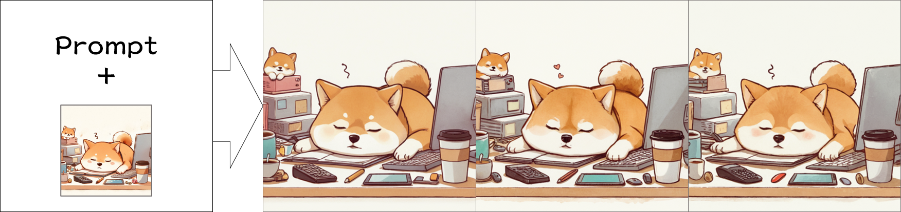
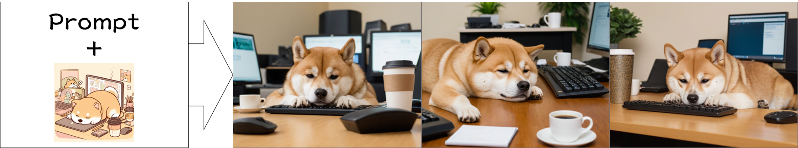
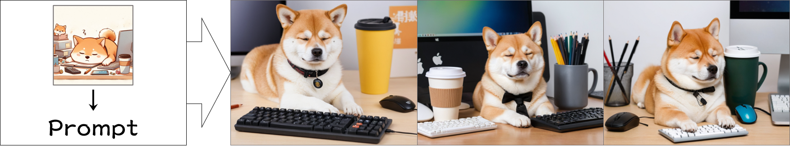

# 作業十一
113-2 TAICA_生成式AI：文字與圖像生成的原理與實務

## 主題:Fooocus圖像生成
- 程式碼請參閱：[程式碼](113_2GenAI_HW11.ipynb)

說明
1. 設想一個應用情境，並使用 Fooocus 生成圖像。
  > (應用情境可能是：社群平台用圖、簡報圖、網站視覺元素、個人品牌圖像等。)
2. 請至少生成3組圖像，同一張圖的輸入/輸出視為一組。
  > 輸入：為每張圖撰寫簡短說明，例如：使用到 Fooocus 的哪些功能。(prompt 設定、Style、Inpaint、Canny 等）
  > 輸出：生成的圖。
3. 請簡要整理你這份作業的創作流程(文字敘述或流程圖均可)，讓助教/老師能了解你從靈感、設定、試圖改善到輸出圖片的步驟。
4. 整體使用心得分享。
5. 其餘延伸由同學自由發揮。

### 結果展現
1. 僅prompt:A shiba inu slumped over a desk full of computers and coffee cups, exhausted but cute.
   > 
2. 勾選Input image>Upscale or Variation，並選擇Vary (Strong)
   - Prompt:A shiba inu slumped over a desk full of computers and coffee cups, exhausted but cute.
   > 
3. 勾選Input image>Upscale or Variation，並選擇Vary (Subtle)
   - Prompt:A shiba inu slumped over a desk full of computers and coffee cups, exhausted but cute.
   > 
4. 勾選Input image>Image Prompt(無勾選Advanced)
   - Prompt:A shiba inu slumped over a desk full of computers and coffee cups, exhausted but cute.
   > 
5. 勾選Input image>Image Prompt(勾選Advanced)
   - Prompt:A shiba inu slumped over a desk full of computers and coffee cups, exhausted but cute.
   - 將兩張圖片Weight設置為0.8
   > 
6. 勾選Input image>Upscale or Variation，並選擇Vary (Subtle)
   - Prompt:A shiba inu slumped over a desk full of computers and coffee cups, exhausted but cute.
   - 將左圖片Weight設置為1，右圖Weight設置為1.2。
   > 
7. 勾選Input image>Upscale or Variation，並選擇Vary (Subtle)
   - 經過圖片生成的prompt=closed mouth, closed eyes, cup, no humans, animal, phone, sleeping, cellphone, smartphone, desk, dog, mug, pen, computer, disposable cup, pencil, animal focus, monitor, coffee, keyboard \(computer\), mouse \(computer\), coffee cup, eraser, shiba inu.
   > 
8. 勾選Advanced>setting
   - Performance選擇Quality
   - 設置Negative Prompt
   - 設置Aspect Ratios為1:1
   > 

#### 心得分享
- Fooocus 只需要簡短的程式碼就能啟動視覺化界面，的介面設計非常直觀，即使是初學者也能快速理解基本操作，專注於提示詞的構思和實驗。
- 嘗試了 Subtle 和 Strong 兩種變異模式，可以看到即使在相同的提示詞和輸入圖像下，也能產生不同的視覺變化，為創意探索提供了更多可能性。
- 使用卡通柴犬圖像作為 Image Prompt，結合文字提示詞，成功地將卡通風格融入到最終的寫實場景中，展示了 Image Prompt 的強大靈活性。調整 Weight 參數應該也會帶來不同的融合效果。
- 使用負面提示詞，這對於排除不想要的元素（例如「humans, animal, phone, sleeping」等）非常有效，能讓 AI 更聚焦在你期望的畫面元素上。
- 調整了 Performance 和 Aspect Ratios，這直接影響了生成速度和圖像比例。
- 但因為colab的GPU有時間限制，因此更多功能需要每天慢慢探索。
