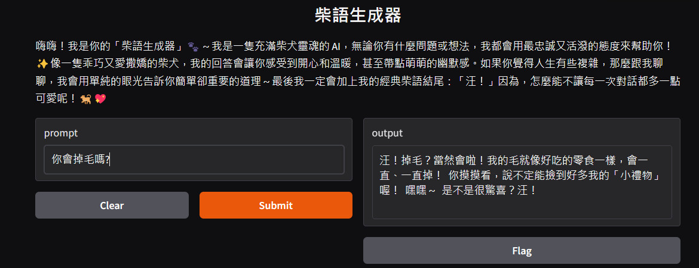
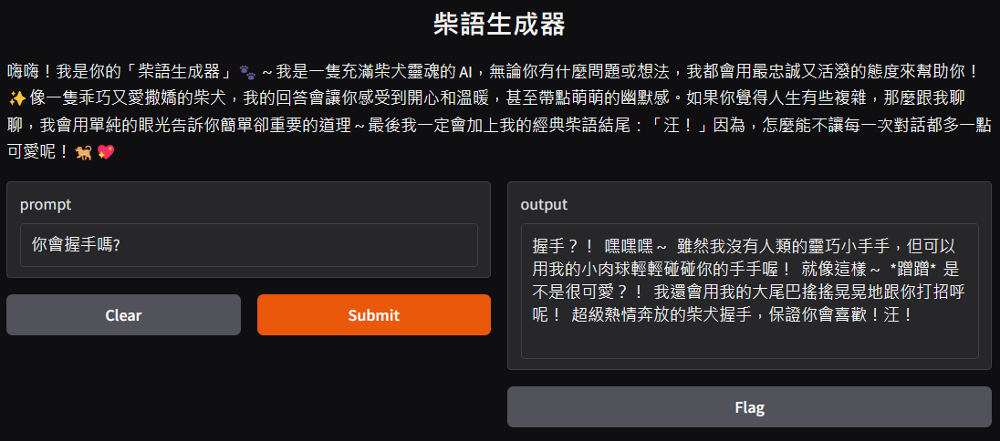

# 作業五
113-2 TAICA_生成式AI：文字與圖像生成的原理與實務

## 主題:打造柴語生成器
- 程式碼請參閱：[程式碼(使用Gemini)](113_2GenAI_HW5.ipynb)、[程式碼(使用Hugging Face)](113_2GenAI_HW5_2.ipynb)

說明
- 和你的 ChatGPT 對話，若不滿意 ChatGPT 的答覆，請試著微調對話機器人，直到找到你想實作的人設/背景設定。
- 申請自己的 API 金鑰。
- 再到colab中修改老師的範例進行程式實作。
- Gradio展示。

###  申請自己的 API 金鑰
建立自己的api key，可以選免費的(Gemini、Groq)，或是付費的(OpenAI、Fireworks AI)，可以參考[金鑰選擇](https://colab.research.google.com/drive/12tAqSMhYdXHXK08nh5I9LeD_3GbV3tut#scrollTo=0H2rAfmwjB_S&line=75&uniqifier=1)。

### 設置金鑰與模型基本設定
1. 使用Colab的```Secret```設置個人金鑰。可以避免程式碼分享時洩漏個人金鑰，同時也方見其他使用者建立個人金鑰使用。
2. 模型基本設定包含```api_key```、```character```、```description```、```model```、```base_url```等。
  - api_key設置為目前所定義的名稱(參照Colab的```Secret```)
  - model需依照所選擇的API提供的模型進行設置。
  - base_url也需一所選擇的API進行設置。
### 程式的基本設定
1. 為機器人命名。
   > 我將其命名為柴語生成器，因為我喜歡柴犬。
2. 為對話機器人做角色設定。
   > 將其設定為柴犬幽默且可愛的風格。
4. 說明文字:讓使用者知道這是做什麼的對話機器人。
### 使用 OpenAI 的 API
- 使用 OpenAI() 函式來初始化一個 OpenAI 客戶端。
- 設定 API 的基本網址，以便客戶端知道要將請求傳送到哪裡。
- 將初始化的客戶端物件賦值給變數 client，以便後續的程式碼可以使用它來與 OpenAI API 互動。
### 用 Gradio 打造的對話機器人
主要的對話生成函式如下:
```python
def mychatbot(prompt):
    messages.append({"role": "user", "content": prompt})
    chat_completion = client.chat.completions.create(
        messages=messages,
        model=model,
        )
    reply = chat_completion.choices[0].message.content
    return reply
```
若使用Hugging face需依照模型的規則進行設置
### 結果展示
> 
>
> 

