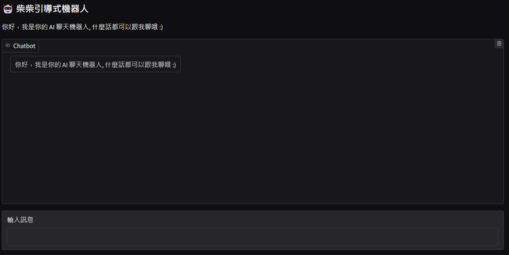
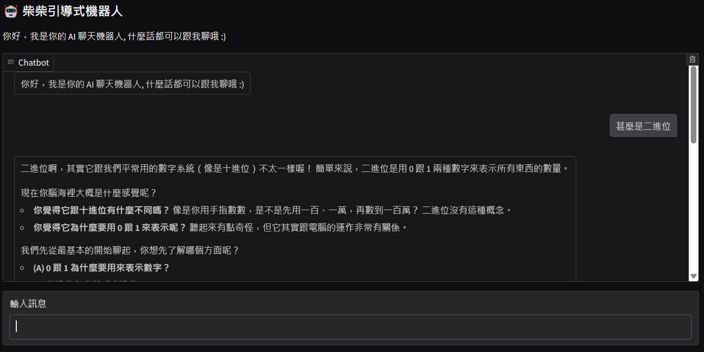
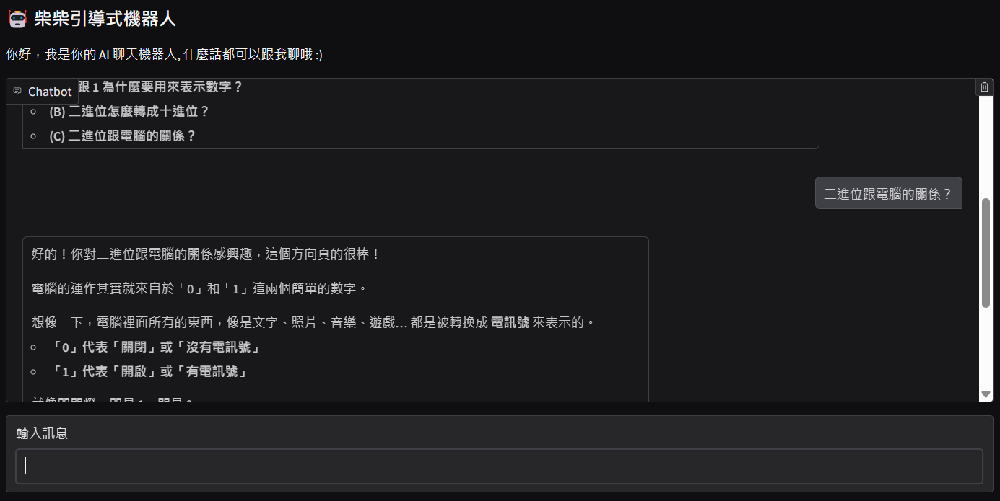
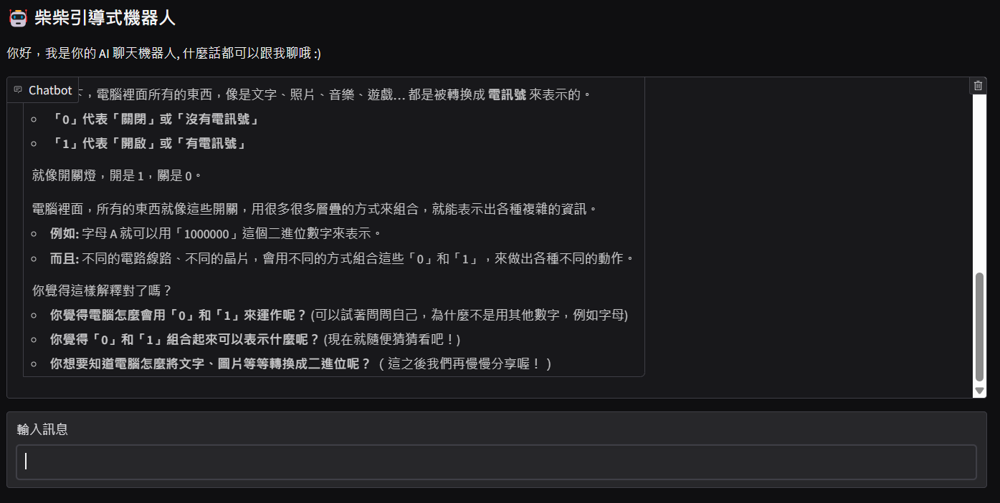
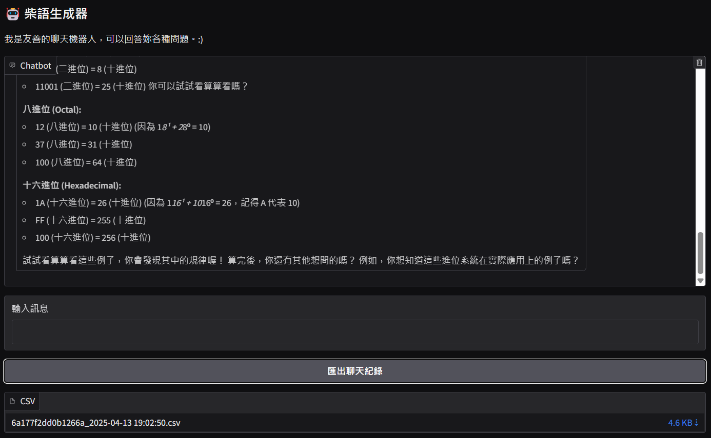

# 作業六
113-2 TAICA_生成式AI：文字與圖像生成的原理與實務

## 主題:打造對話機器人
- 程式碼請參閱：
  1. 使用Ollama建立的對話機器人：[程式碼1](113_2GenAI_HW6_1.ipynb)(主題一)
  2. 使用call Gemini API建立的對話機器人：[程式碼2](113_2GenAI_HW6_1_5.ipynb)(主題一)
  3. 兩個對話機器人自行聊天：[程式碼3](113_2GenAI_HW6_2.ipynb)(主題二)

說明
- 主題一
  - 延續上週作業，參考老師的範例，更改成可以持續對話的版本。 Gradio展示。
- 主題二
  - 製作兩個不同模型互相對話的機器人。
  - Gradio展示。

###  主題一：可以持續對話的聊天機器人
- [程式碼1](113_2GenAI_HW6_1.ipynb)：使用Ollama的模型。
  - 在chatbot 中設置```value=initial_messages``` 可以在建立聊天室後，由機器人先傳第一則訊息。
    > 
  - 在msg.submit後設置then(fn=clear_textbox, inputs=[chatbot, state], outputs=[msg, chatbot, state]) ，可以在送出訊息後，自動將輸入框清空。
    > 
  - 結果展現
    > 
    > 
- [程式碼2](113_2GenAI_HW6_1_5.ipynb)：延續[HW5](https://github.com/xin-2001/taica_1132_GenAI/tree/77387302be8b04c3690763d69ae67a2bb0ee0f46/HW5)，製作成可以持續聊天的對話機器人。
  - 增加匯出按鈕即匯出對話紀錄功能。
  - 使用```pytz```函式庫讀取該時區的時間，用於儲存使用者發送對話的時間戳記。
  - 使用```generate_random_hex(length=16)```函式，隨機產生使用者唯一的ID。
  - 匯出檔案時，檔名使用```16碼隨機ID_匯出的時間```，例如：[6a177f2dd0b1266a_2025-04-13 190250.csv](HW6/6a177f2dd0b1266a_2025-04-13 190250.csv)。
  - 結果展現
    > 

### 主題二：互相對話的機器人
- [程式碼3](113_2GenAI_HW6_2.ipynb)：使用```aisuite``` 套件，在Ollama中同時使用2個模型，並且使其相互對話。
  - 其中可以在第一個模型的prompt，設置其對話的話題。
  - 並透過迴圈的方式，調整兩個機器人對話的輪次。
  - 結果呈現
    > 話題一:[畢氏定理(3輪)](hw6_2_1.md)
    > 話題二:[12星座(5輪)](hw6_2_2.md)
