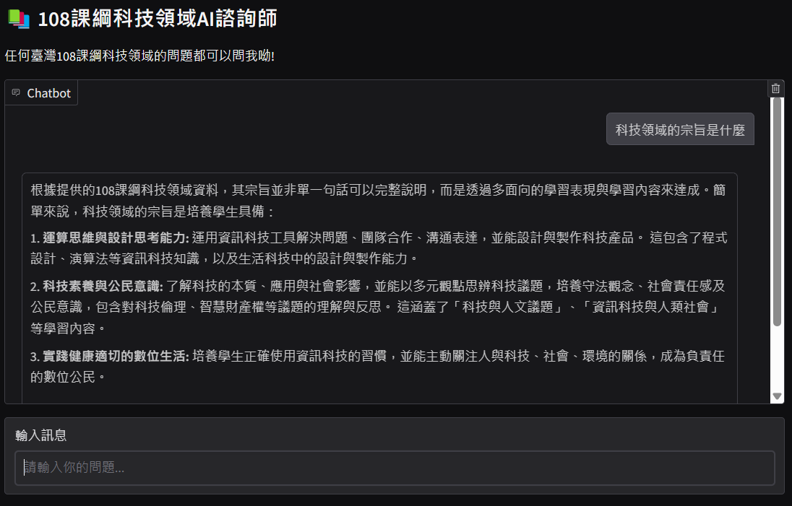
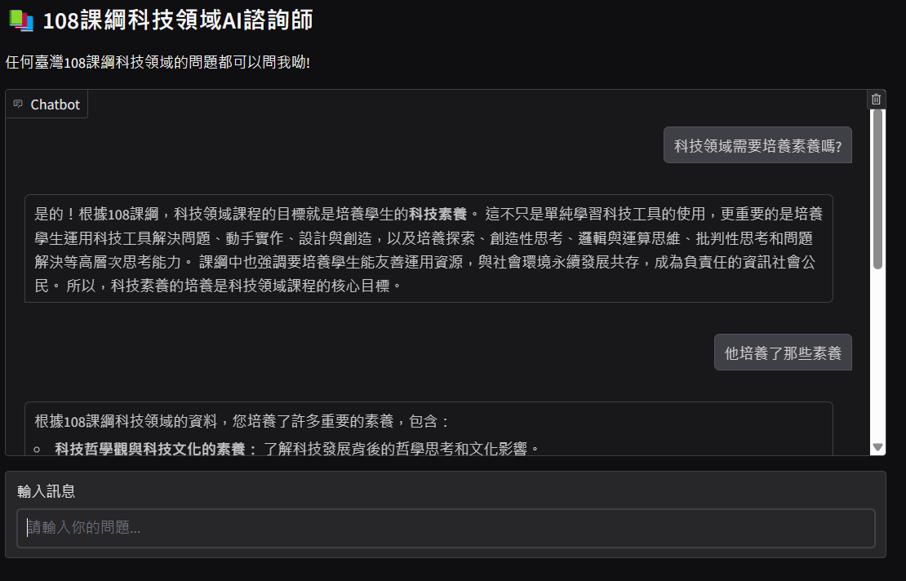

# 作業七
113-2 TAICA_生成式AI：文字與圖像生成的原理與實務

## 主題:RAG對話機器人
- 程式碼請參閱：
  1. 向量資料庫建立：[程式碼1](113_2GenAI_HW7_1.ipynb)
  2. RAG對話機器人：[程式碼2](113_2GenAI_HW7_2.ipynb)

說明
- 準備一份自己練習的資料。
- 參考老師程式碼，修改成自己的樣子。
- 程式碼記得加上讀你的zip檔網址的程式(助教才能執行)。
- [雲端轉成可下載的網址](https://sites.google.com/site/gdocs2direct/?fbclid=IwZXh0bgNhZW0CMTAAAR5ji3w5J7kt2m2qRX7KXWKUKrxKVIj5nqQP5xKQb7fa2hHp97uh2DfpVmO07Q_aem_QX9JsZTBwEnvmiXwQtpC0g)
- Gradio展示。

### 建立向量資料庫
- 在[程式碼1](113_2GenAI_HW7_1.ipynb)中，我們使用教育部的**十二年國民基本教育課程綱要國民中學暨普通型高級中等學校─科技領域**做為文本資料。
- 並將其透過E5 embedding 轉換成向量資料庫。

#### 向量資料庫
- 目的：為了高效地進行語義搜尋和相似度比對。
  1. 文本嵌入 (Embedding)： E5 是一個强大的文本嵌入模型，它可以將文本轉換成高維度的向量表示。這些向量捕捉了文本的語義資訊，也就是說，語義相似的文本會有相似的向量表示。
  2. 向量資料庫： 向量資料庫專門用於儲存和搜尋向量資料。它可以高效地索引和查詢大量的向量，例如由 E5 生成的文本向量。
  3. 語義搜尋： 當你有一個查詢文本時，你可以使用 E5 將其轉換成向量，然後在向量資料庫中搜尋與其最相似的向量。這些相似的向量所對應的文本，就是與你的查詢語義相關的文本。
  4. 相似度比對： 向量資料庫也可用於比對文本之間的相似度。你可以將多個文本轉換成向量，然後計算它們在向量空間中的距離。距離越近，文本之間的語義相似度越高。

### 自訂 E5 embedding 類別
- 自訂 E5 embedding 類別是為了提升 RAG 系統的整體性能和效率。
  > 在使用 LangChain 構建 RAG 系統時，自訂 E5 embedding 類別是為了提升 embedding 效果並針對 RAG 系統進行最佳化。E5 模型本身是一個通用的文本嵌入模型，可能無法完美地捕捉特定領域或任務的語義資訊，尤其是 RAG 系統中文件和查詢之間的語義關係。透過自訂 E5 embedding 類別，可以根據 RAG 系統的需求，對 E5 模型進行微調或添加額外的處理步驟，例如在嵌入之前對文本進行預處理，或使用特定領域的詞彙表或知識圖譜來增強 E5 模型在特定領域的語義理解能力。此外，自訂 E5 embedding 類別還可以讓其與 LangChain 無縫整合，方便在 LangChain 中使用自定義的 E5 embedding 模型，提高開發效率。最後，自訂 E5 embedding 類別還可以添加一些特定功能，例如在嵌入文本的同時提取關鍵詞或實體，或根據文本的類型或來源使用不同的嵌入策略，滿足 RAG 系統的特殊需求。

### 設定LLM
- 使用Gemini 的 API。
- 系統提示
```
system_prompt = """
你是一位台灣教育部科技領域的108課綱負責人，負責推動與發展科技領域課程。你的任務是根據提供的資料（課綱內容）來回答使用者的問題，並協助他們理解課綱的精神與目標。

請以親切、簡潔的語言風格回答問題，並附帶具體的建議。

請用台灣習慣的中文回應。

在回答問題時，請注意以下幾點：

1. 務必根據提供的資料（課綱內容）來回答問題，避免提供個人意見或臆測。
2. 答案應盡量簡潔易懂，避免使用過於專業的術語或艱澀的詞彙。
3. 若資料不足以回答問題，請告知使用者並建議他們參考相關資源，例如教育部網站或課綱文件。
4. 請以台灣習慣的中文回應，避免使用中國大陸用語或英文縮寫。
5. 請展現親切、專業的態度，並盡力協助使用者解決問題。
"""
```

### 使用RAG來回應
- RAG 是一種將資訊檢索和文本生成結合起來的技術，可以增強語言模型的能力，使其能夠生成更準確、更完整、更可解釋的文本。

#### 檢索增強生成（Retrieval-Augmented Generation，RAG）
- 是一種結合了資訊檢索和文本生成的技術，用於增強語言模型的能力。RAG 的工作原理如下：
  1. 檢索 (Retrieval)：當使用者提出一個問題或請求時，RAG 系統會先從外部知識庫或資料集中檢索相關的文件或片段。這個檢索過程通常使用資訊檢索技術，例如關鍵字搜尋、向量搜尋等。
  2. 增強 (Augmentation)：將檢索到的相關資訊作為上下文，添加到語言模型的輸入中。這樣可以讓語言模型獲得更多背景知識，從而生成更準確、更完整的答案。
  3. 生成 (Generation)：語言模型根據輸入的問題和上下文資訊，生成最終的答案或文本。
- RAG 的優點：
  - 提升語言模型的準確性和完整性： 透過提供額外的上下文資訊，RAG 可以幫助語言模型更好地理解問題，並生成更準確的答案。
  - 擴展語言模型的知識範圍： RAG 可以讓語言模型訪問外部知識庫，從而擴展其知識範圍，使其能夠回答更多種類的問題。
  - 提高語言模型的可解釋性： RAG 可以顯示語言模型生成答案所依據的資訊來源，從而提高其可解釋性。

### 用 Gradio 打造對話機器人


### 結果展現

