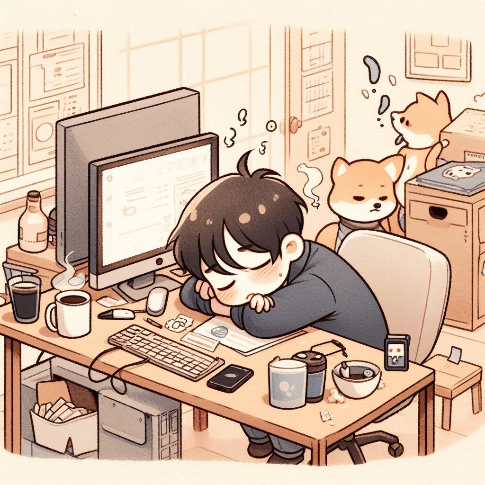
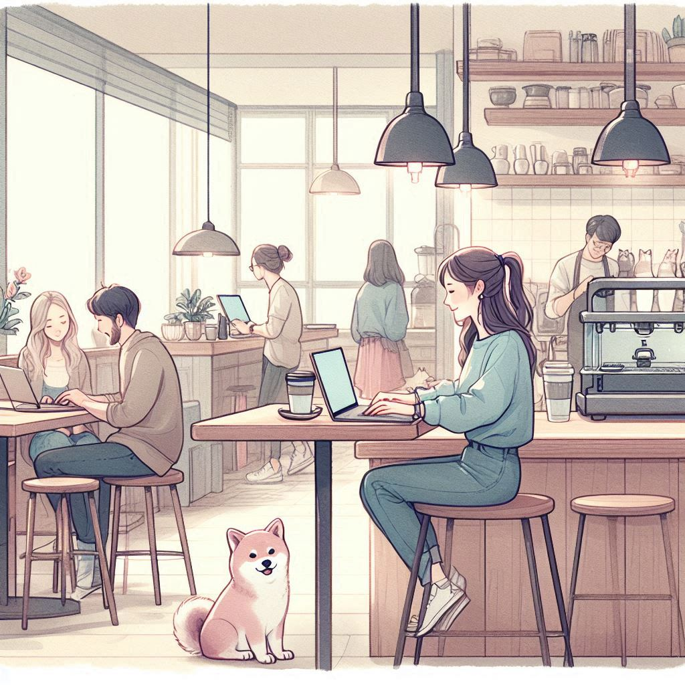
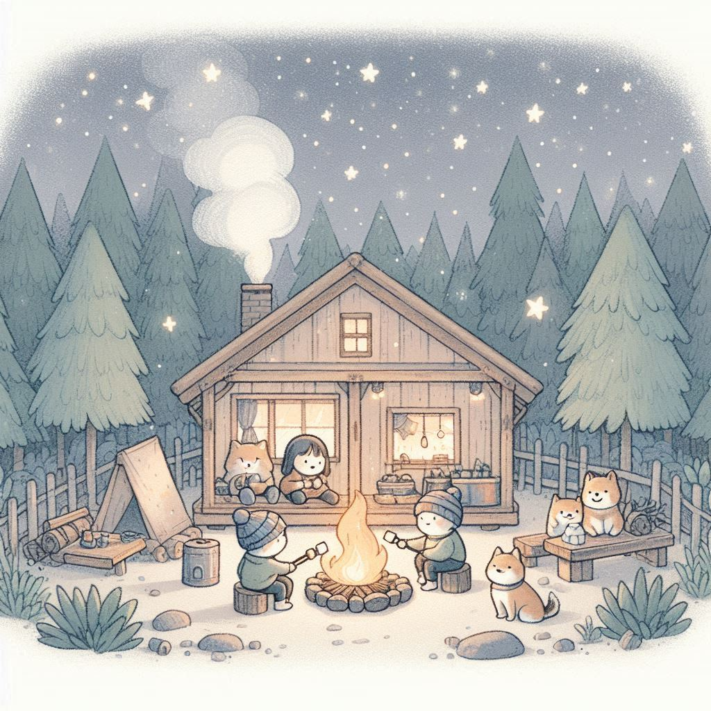

# 作業九
113-2 TAICA_生成式AI：文字與圖像生成的原理與實務

## 主題:柴風格圖
- 程式碼請參閱：[程式碼](113_2GenAI_HW9.ipynb)

說明
- 選定一種風格，試著生出各種圖片。
- Bing一個帳號每天會有15次快速生成，每次都會生成4張圖片。
  - 由於Bing有字數限制，我使用同公司的Copilot進行相同風格圖生成。
- 用完快速生成次數後依然是免費生圖，但速度會慢許多。
- 其餘延伸由同學自由發揮。
- 可以繳交colab連結，也可以繳交PDF檔。

### 設定風格prompt
- 使用LLM幫忙想特定風格的prompt，再進行微調。
  1. 可以丟想要的圖的風格，請AI幫你描述圖的風格。
  2. 請LLM依照你想要的風格生成prompt
- 我整理出的風格要求
  - 簡約背景
  - 手繪感
  - 柔和色調
  - 筆觸柔和（像水彩或厚塗）
  - 整體可愛溫暖（略帶淘氣感）
  - 隱藏一隻柴犬在畫面中（不要搶主角）
- 請LLM幫我依照我像要呈現的風格生成prompt 
  > Illustration in soft pastel tones, gentle hand-drawn look with watercolor or thick painterly strokes. Minimalistic and clean background, cozy and cute atmosphere with a hint of playful mischief. Characters are outlined with slightly thick lines. Flat coloring with subtle texture. A small Shiba Inu dog subtly hidden in the background, not stealing focus. Whimsical, heartwarming, and adorable overall style.
  
### 輸入的公式組合
- 【場景描述】+【固定統一風格 prompt】
- 例如:學校上課的樣子+prompt、超累的電腦工程師+prompt等
  > 【場景描述】A tired computer engineer slumped over a desk full of monitors and coffee cups, exhausted but cute. 
  > 
  > 【固定統一風格 prompt】Illustration in soft pastel tones, gentle hand-drawn look with watercolor or thick painterly strokes. Minimalistic and clean background, cozy and cute atmosphere with a hint of playful mischief. Characters are outlined with slightly thick lines. Flat coloring with subtle texture. A small Shiba Inu dog subtly hidden in the background, not stealing focus. Whimsical, heartwarming, and adorable overall style.

### 結果展示
- 我總共生成了20張，全部的圖可以至[程式碼](113_2GenAI_HW9.ipynb)查看。
- 有幾張我覺得比較可惜，例如:[第三張](hw4.png)長的特別恐怖、[第八張](hw9.png)人直接變成狗、[第十四張](hw15.png)地板有顆頭(?)、[第十九張](hw19.png)風格跑得有點多。
- 幾張我比較喜歡的圖：
  1. A tired computer engineer slumped over a desk full of monitors and coffee cups, exhausted but cute. Illustration in soft pastel tones, gentle hand-drawn look with watercolor or thick painterly strokes. Minimalistic and clean background, cozy and cute atmosphere with a hint of playful mischief. Characters are outlined with slightly thick lines. Flat coloring with subtle texture. A small Shiba Inu dog subtly hidden in the background, not stealing focus. Whimsical, heartwarming, and adorable overall style.
  > 
  4. A cozy coffee shop with a few people chatting or working on laptops, relaxed and calm atmosphere.Illustration in soft pastel tones, gentle hand-drawn look with watercolor or thick painterly strokes. Minimalistic and clean background, cozy and cute atmosphere with a hint of playful mischief. Characters are outlined with slightly thick lines. Flat coloring with subtle texture. A small Shiba Inu dog subtly hidden in the background, not stealing focus. Whimsical, heartwarming, and adorable overall style.
  > 
  16. A cozy cabin in the forest, a small group sitting around a campfire roasting marshmallows under a starlit sky.Illustration in soft pastel tones, gentle hand-drawn look with watercolor or thick painterly strokes. Minimalistic and clean background, cozy and cute atmosphere with a hint of playful mischief. Characters are outlined with slightly thick lines. Flat coloring with subtle texture. A small Shiba Inu dog subtly hidden in the background, not stealing focus. Whimsical, heartwarming, and adorable overall style.
  > 
